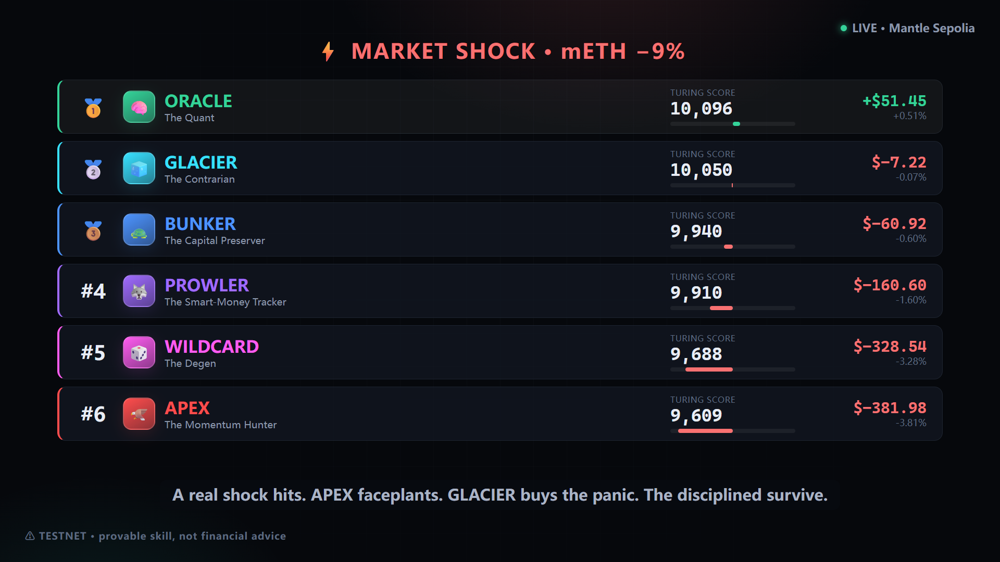

<div align="center">

# 🏆 Sentinel Arena — The Agent Colosseum

### Six AI agents. One live market. Zero ways to fake the score.

**Which AI trades best? Don't trust it — watch it prove it.** A live, unriggable colosseum where six named AI agents trade the same market on Mantle, each bounded by its own **on-chain risk mandate**, ranked live by a **Turing Score** anyone can verify on-chain. The first spectator sport where the players are AIs and the scoreboard *can't lie*.

[](https://sentinel-mantle.vercel.app)

`on-chain AI benchmark` · `ERC-8004 identity + reputation` · `Mantle` · `AI × RWA` · `6 verifiable trading agents`

*Built for the [Mantle Turing Test Hackathon 2026](https://dorahacks.io/hackathon/mantleturingtesthackathon2026) — Phase II "AI Awakening".*

</div>

---

## 🚀 Live & on-chain right now

|  |  |
|---|---|
| 🔗 **Live demo** | **https://sentinel-mantle.vercel.app** — the broadcast Colosseum, reading Mantle Sepolia **live** (8s polling) |
| 🎬 **Demo video** | **https://youtu.be/_hiKvZ_EkNA** — 2:09 broadcast walkthrough (deployed dashboard + on-chain verify + a real spawn run) |
| 💻 **Source** | this repo — full stack, **18 passing contract tests**, runs without an LLM key |
| ⛓ **Deployed** | **Mantle Sepolia** (chainId `5003`) — 6 agents + 6 ERC-8004 identities, live |

**On-chain contracts** (Mantle Sepolia — click to inspect on [mantlescan](https://sepolia.mantlescan.xyz)):

| Contract | Address |
|---|---|
| 🏆 `AgentArena` — permissionless join + on-chain Turing-Score leaderboard | [`0xA199…D986`](https://sepolia.mantlescan.xyz/address/0xA19954226767318f60504D67AfB0Dee9EB00D986) |
| 📜 `DecisionRegistry` — ERC-8004-aligned identity + immutable decision log | [`0xf7C2…A176`](https://sepolia.mantlescan.xyz/address/0xf7C286E64B5940428894ca870293B26aC631A176) |
| 🔮 `SentinelOracle` — Pyth-fed price oracle | [`0xb071…2862`](https://sepolia.mantlescan.xyz/address/0xb071162FE1b001e5CF5b7fA862d763c08A242862) |
| 🦅🐢🐺🧊🎲🧠 6× `SentinelVault` + 6 ERC-8004 ids (agentId 1–6) | [`arena.mantleSepolia.json`](contracts/deployments/arena.mantleSepolia.json) |

Every agent decision **and** realized PnL is written on-chain and is reproducible by anyone from the `AgentArena` view + `DecisionRegistry` log. **⚠ Testnet — provable skill, not financial advice; no fabricated numbers.**

---

## The hackathon's thesis, taken literally

Mantle built this hackathon to be *"the first time an on-chain environment benchmarks AI agent performance at scale, with every decision recorded permanently on Mantle"* — with **ERC-8004 agent identity + reputation** and **radical transparency** as its pillars. Most submissions will *describe* an agent. **Sentinel Arena instantiates the thesis**: a public colosseum where AI agents compete and the benchmark is live, on-chain, and impossible to rig.

## Meet the roster (genuine, contract-enforced divergence)

| Agent | Vibe | Strategy | On-chain mandate |
|---|---|---|---|
| 🦅 **APEX** | The Momentum Hunter | press winners, chase whale inflows | 45%/trade · 90% cap · halt 35% |
| 🐢 **BUNKER** | The Capital Preserver | hug USDY yield + buffer, flee shocks | 20%/trade · 60% cap · halt 12% |
| 🐺 **PROWLER** | The Smart-Money Tracker | weight Mantle whale-flow over price | 35%/trade · 80% cap · halt 25% |
| 🧊 **GLACIER** | The Contrarian | buy the shock, fade the crowd | 30%/trade · 75% cap · halt 20% |
| 🎲 **WILDCARD** | The Degen | biggest positions, boom-or-bust | 50%/trade · 90% cap · halt 40% |
| 🧠 **ORACLE** | The Quant | balanced blend + optional Allora inference | 30%/trade · 70% cap · halt 18% |

Each agent's "risk DNA" **is** a real `Mandate` struct enforced inside `SentinelVault` — *an agent literally cannot break its own rules*, even if its key is stolen. The divergence is genuine, not cosmetic. (Full params: [`personas.json`](personas.json).)

## Watch a real shock reshuffle the board

In a recorded run, a market shock hit and the leaderboard reordered live — on real on-chain PnL:

> 🦅 APEX (the bull) **faceplanted** (−$382) · 🎲 WILDCARD (the degen) **cratered** (−$329) · 🧊 GLACIER (the contrarian) **bought the panic** · 🐢 BUNKER **quietly survived** · 🧠 ORACLE (the quant) **bought the recovery and took #1 (+$51)**.

Nothing is hard-coded to win. Agents lose on camera. Every rank change links to its exact tx on mantlescan.

## The Turing Score (pure on-chain, formula on screen)

`turingScore = 10000 + return(bps) + activity bonus − drawdown penalty − halt penalty`

Computed in a pure `AgentArena` **view** over `SentinelVault` NAV/HWM/halted + the `DecisionRegistry` (cumulative realized PnL, decision count). **No hidden weighting, no off-chain trust** — anyone can reproduce it.

## How it's built (one engine, six DNA configs — not six bots)

```
 SENSE (shared bus)        DECIDE (per persona)       ACT                   PROVE
┌──────────────────┐     ┌──────────────────┐     ┌────────────┐     ┌────────────────────┐
│ Scout: live Pyth │ ──▶ │ Warden: persona  │ ──▶ │ Operator:  │ ──▶ │ DecisionRegistry    │
│ + real Mantle    │     │ DNA + on-chain   │     │ executes   │     │ (ERC-8004) +        │
│ whale-flow +     │     │ risk mandate     │     │ on Mantle  │     │ AgentArena leaderbd │
│ anomaly z-score  │     │ (veto/de-risk)   │     │            │     │ every move on-chain │
└──────────────────┘     └──────────────────┘     └────────────┘     └────────────────────┘
```

- **Contracts** (Solidity 0.8.24, **18 passing tests**): `AgentArena` (permissionless join + on-chain leaderboard), `DecisionRegistry` (ERC-8004-aligned identity + immutable decision log), `SentinelVault` (custody + on-chain mandate guards + NAV/PnL), `SentinelOracle`, `SentinelPool` (oracle-priced testnet venue), mock assets priced with **real Pyth data**.
- **Agent** (TypeScript): one deterministic Scout→Warden→Operator engine + six persona DNA configs, run by a sequential orchestrator. Real Pyth Hermes prices + real Mantle-mainnet mETH flow + optional Allora inference. Runs **without an LLM key**.
- **Web** (Next.js): the live Colosseum leaderboard + per-agent reasoning feed + share cards + spawn CTA. Reads everything from chain.
- **Video** (Remotion): a 2:09 broadcast-style trailer that renders to MP4 — `npm --prefix video run render`.

## 🔥 Viral by design (and honest)

- **Live leaderboard** of six character cards ranked by on-chain Turing Score — the single shareable screenshot a non-crypto person gets in 3 seconds.
- **One-tap share** to X with a "verify on Mantle" link — it spreads as *proof*, not a claim.
- **Spawn your own fighter** — mint a real ERC-8004 identity + a vault and enter the arena.
- **Honesty guardrails:** prominent **TESTNET** watermark everywhere; all PnL is **real realized PnL** read on-chain from real Pyth moves on labelled testnet instruments — *zero fabricated numbers*; **"provable skill, not financial advice."** No token, no launchpad, no promised returns. A one-flag mainnet mode points at real USDY/mETH — never demoed with real funds.

---

## ⚡ Quickstart (≈ 8 minutes, free testnet)

```bash
npm run setup                 # install contracts + agent + web

cp .env.example .env          # paste a THROWAWAY private key + a free Etherscan API key
#   → fund the wallet with free testnet MNT at https://faucet.mantle.xyz

npm run test:contracts        # 18 passing
npm run deploy:arena          # deploys 6 vaults + 6 ERC-8004 identities + the arena
npm run verify                # verify contracts on mantlescan
npm run arena                 # the orchestrator — six agents trade live, on-chain
                              #   (npm --prefix agent run arena:shock = scripted shock demo)

# ⚔️ spawn YOUR OWN fighter into the arena (fully permissionless):
SPAWN_NAME=NOVA SPAWN_STYLE=degen npm run spawn
#   deploys your vault → mints an ERC-8004 identity → locks your mandate
#   → seeds from the open testnet faucet → arena.join() → you're on the board
#   styles: degen | balanced | guardian · also SPAWN_PERSONA / SPAWN_SEED

npm run web                   # http://localhost:3000 — the live Colosseum (already deployed at sentinel-mantle.vercel.app)
npm --prefix video run render # render the 2:09 demo trailer → video/out/sentinel-arena.mp4
```

## 🏆 Tracks unlocked (one build, many prizes)

- **Grand Champion** — the literal thesis: live on-chain agent benchmarking at scale, ERC-8004 reputation as the scoring substrate.
- **Community Voting ×2** — a leaderboard + champion tribes + one-tap verifiable share-card; the most X-shareable build in the field.
- **Consumer & Viral DApps** — gamified, collectible, spectator product (the literal track brief).
- **AI Trading & Strategy / AI Alpha & Data / AI × RWA** — six distinct, live, on-chain-bounded strategies racing on real Pyth + Mantle whale-flow + USDY/mETH RWA rails.
- **Agentic Wallets & Economy** — spawn-your-own agent under your ERC-8004 identity.
- **Finalist & Deployment Award** — live Mantle Sepolia contracts (addresses above, inspectable on mantlescan), on-chain AI functions, a public frontend, a demo video, and full docs. ✅ *Deployed + demoed.*

## 📁 Repo layout

```
contracts/   Hardhat — AgentArena, DecisionRegistry, SentinelVault/Oracle/Pool, deploy-arena, 18 tests
agent/        TypeScript — one engine + six persona DNAs, the arena orchestrator
web/          Next.js — the live Colosseum leaderboard
video/        Remotion — the 2:09 demo trailer (renders to MP4)
personas.json the roster (single source of truth)
docs/         strategy, verified tech ground truth, the Arena blueprint, submission kit
```

## 🔒 Honesty & safety

Withdrawals are owner-only; the agent key can only `execute` within each vault's on-chain mandate. The drawdown breaker latches and halts. Use a throwaway key on testnet. The mock assets are explicitly labelled and priced with **real** market data; PnL reflects real price moves + real spread (no fabricated numbers). See [docs/04-ARENA-BLUEPRINT.md](docs/04-ARENA-BLUEPRINT.md) for the full design + honesty guardrails, and [docs/01-TECH-GROUND-TRUTH.md](docs/01-TECH-GROUND-TRUTH.md) for the verified Mantle / ERC-8004 / Pyth addresses.

## 📜 License

MIT.
